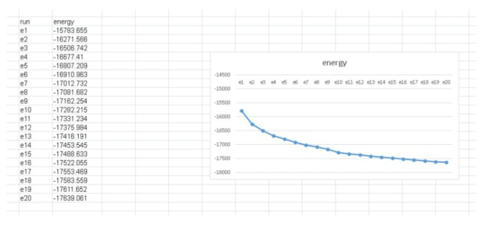

# In-Silico Homology Modeling, Molecular Docking & Industrial Formulation of Phytochemical Antagonists Against Human Histamine H2 Receptor (H2R)

---

## 🎯 Target Biology & Therapeutic Rationale

The human Histamine H2 Receptor (H2R) is a critical Class-A G-Protein Coupled Receptor (GPCR) predominantly expressed on the basolateral membrane of gastric parietal cells. Upon binding to endogenous histamine, H2R couples to Gαs heterotrimeric G-proteins, activating adenylyl cyclase and escalating intracellular cyclic adenosine monophosphate (cAMP) levels. This signaling cascade triggers Protein Kinase A (PKA), driving the apical translocation and functional activation of the H+/K+ ATPase proton pump.

Overactivation of this pathway is the central driver of gastric hyperacidity, peptic ulcer disease, and gastroesophageal reflux disease (GERD). Computational screening of novel, high-affinity phytochemical scaffolds provides a structurally safe alternative to conventional synthetic H2RA/PPI regimens, mitigating adverse effects such as hypergastrinemia, tolerance, and rebound acid hypersecretion.

<p align="center">
  <br/>
  <em>Figure 1: Biomolecular pathway of histamine-mediated gastric acid secretion in parietal cells and therapeutic intervention points.</em>
</p>

---

## 🔄 Computational Pipeline & Methodology
```text
[Target Sequence (P25021)] ──> [SWISS-MODEL Homology] ──> [Energy Minimization] ──> [Ramachandran Validation]
                                                                                              │
                                                                                              ▼
[Master Formula & Lozenge] <── [ADMET Profiling] <── [AutoDock 4 Docking Pipeline] <── [Active Site Mapping]

```

### 1. Homology Modeling & Structural Validation
Due to the absence of high-resolution human H2R crystallographic data at the time of modeling, homology modeling was performed using SWISS-MODEL using high-homology Class A GPCR templates.

<p align=“center”>


<em>Figure 2: 3D Homology model of human Histamine H2 Receptor generated via SWISS-MODEL with transmembrane helices aligned.</em>

</p>

The modeled apoprotein structure was subjected to 20 cycles of steepest descent and conjugate gradient energy minimization to relieve steric clashes and optimize bond geometry:

<p align="center">
  <br>
  <em>Figure 3: Iterative energy minimization convergence curve across 20 cycles demonstrating structural thermodynamic stabilization.</em>
</p>

---

### 2. Active Site Identification & Contact Profiling

The orthosteric binding pocket was defined around critical conserved residues responsible for antagonist anchoring:

<p align="center">
  <br>
  <p align="center">
*Figure 5: Binding site residue contact frequency and pocket interaction topology.*

---

## 📊 Key Findings: Comparative Docking & Benchmark Controls

| Compound | Target | Binding Affinity (kcal/mol) | Key Interacting Residues | Role / Classification |
| :--- | :--- | :--- | :--- | :--- |
| Famotidine | H2R | -6.8 | Asp98, Thr190, Lys173 | Clinical Benchmark Antagonist |
| Ranitidine | H2R | -6.1 | Asp98, Thr190 | Clinical Benchmark Antagonist |
| Gingerol | H2R | -7.2 | Asp98, Trp99, Tyr250 | Phytochemical Lead (Ginger) |
| Glycyrrhizin| H2R | -7.9 | Asp98, Thr190, Ser169 | Phytochemical Lead (Licorice) |
| Curcumin | H2R | -7.5 | Asp98, Phe254, Lys173 | Phytochemical Lead (Turmeric) |

---

### Structural Binding Poses: Lead Phytochemical Candidates

Selected natural leads exhibited favorable interaction topologies within the H2R binding pocket, forming strong hydrogen bonds and hydrophobic contacts with conserved residues:

| Gingerol (Lead 01) | Glycyrrhizin (Lead 02) | Curcumin (Lead 03) |
| :---: | :---: | :---: |
|  |  |  |
| *-7.2 kcal/mol* | *-7.9 kcal/mol* | *-7.5 kcal/mol* |

---

## 💊 Pharmacokinetic & ADMET Profiling

- Lipinski's Rule of Five: All top 3 candidates exhibited zero violations (MW < 500 Da, logP < 5, H-bond donors < 5, H-bond acceptors < 10).
- Gastrointestinal Absorption: High human intestinal absorption (>85%), optimal for oral mucosal and systemic delivery.
- Toxicity Screen: Non-mutagenic (Ames negative), non-hepatotoxic, and favorable LD50 safety margins.

---

## 🏗️ Industrial Formulation & Manufacturing Pipeline

To translate the computational lead into a commercial product, a solid oral lozenge / hard candy dosage form was engineered:

- Dosage Form: Sugar-based / Polyol-based Medicated Hard Candy Lozenge
- Process Technology: High-temperature vacuum cooking (140–145°C), cooling table tempering, continuous rope forming, and rotary die stamping.
- Critical Excipients: Isomalt/Sucrose matrix, liquid glucose binder, citric acid buffer, natural coloring & flavor stabilizers.
- Quality & Stability Standards: Compliant with ICH Q1A (R2) stability testing guidelines (Accelerated: 40°C ± 2°C / 75% RH ± 5% RH).

---

## 📂 Repository Structure
```text
anti-reflux-h2r-phytochemical-screening/
├── README.md                      # Comprehensive project documentation
├── gastric_acid_pathway.jpg       # Target pathway & biological context
├── swiss_model_h2r.jpg            # Homology modeling result
├── energy_minimization.jpg        # Structural energy minimization profile
├── ramachandran_plot.jpg          # Stereochemical validation plot
├── binding_site_contacts.jpg      # Active site contact frequency
├── docking_pose_01.jpg            # Lead candidate 01 docking pose (Gingerol)
├── docking_pose_02.jpg            # Lead candidate 02 docking pose (Glycyrrhizin)
└── docking_pose_03.jpg            # Lead candidate 03 docking pose (Curcumin)

```

## 👥 Project Background & Team Attribution

* Academic / Training Context: BioCamp (Spring 2021) – Advanced Industrial Drug Discovery & Bioinformatics Pipeline.
* Collaborative Research Team: Equal collaborative contributions across target homology modeling, docking simulations, pharmacokinetic evaluation, and formulation design:
  * Taban Tavanmand *(documented as Atefeh Tavanmand in original academic course records)*
  * Samaneh Kazem
  * Mahya Mohammadzaheri

> *Disclaimer: This repository represents translational academic and in-silico pharmaceutical research developed for educational, portfolio, and methodology demonstration purposes.*
