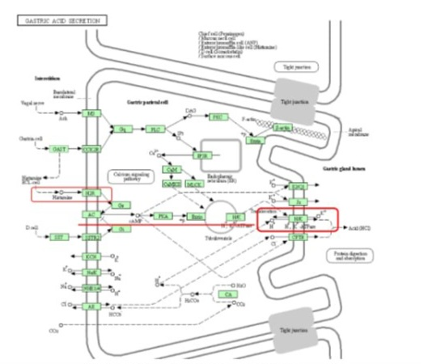
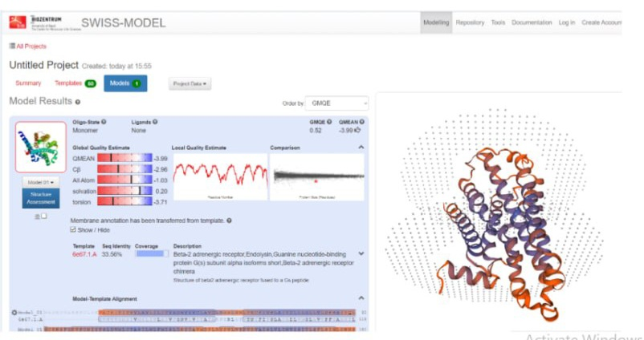
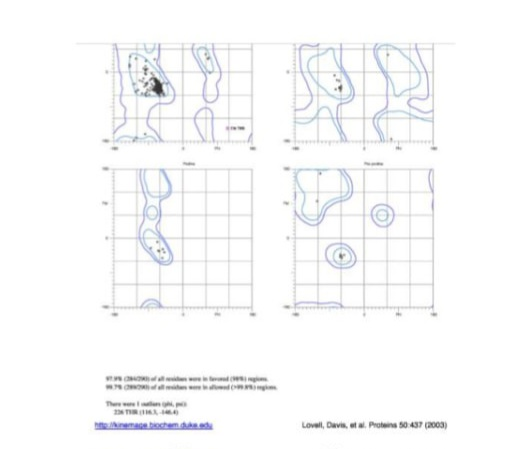
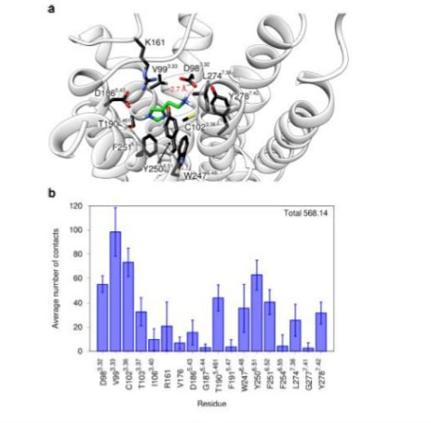
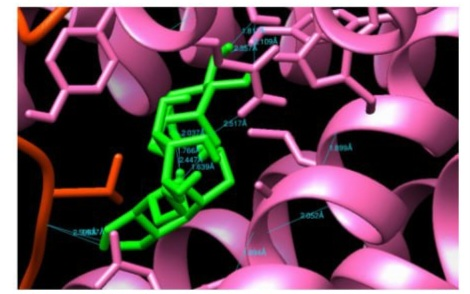
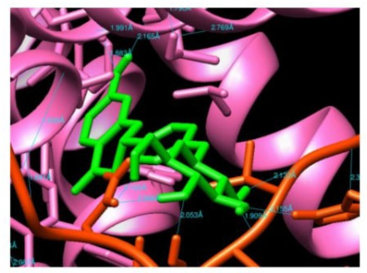
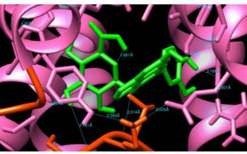

# In-Silico Homology Modeling, Molecular Docking & Industrial Formulation of Phytochemical H2R Antagonists for GERD

[-00557f.svg)](https://www.uniprot.org/uniprotkb/P25021/entry)

---

## 📌 Executive Summary
Gastroesophageal Reflux Disease (GERD) is a prevalent gastrointestinal motility and acid-peptic disorder. Histamine H2 receptor (H2R) antagonists remain a primary therapeutic class for suppressing nocturnal and basal gastric acid secretion. This project presents an end-to-end translational computational drug discovery and pharmaceutical pipeline:
1. Target Structural Elucidation: 3D Homology modeling and stereochemical validation of human Histamine H2 Receptor (UniProt: P25021).
2. Virtual Screening & Molecular Docking: Identification and binding-mode characterization of plant-derived phytochemicals against H2R compared with standard reference antagonists (Famotidine / Cimetidine).
3. ADMET & Drug-Likeness: In-silico pharmacokinetic profiling to ensure high oral bioavailability, metabolic stability, and safety.
4. Translational Pharmaceutical Development: Complete industrial formulation, Master Formula Card, stability protocols (ICH Q1A/Q1F), and scale-up design for an oral medicated lozenge/hard candy.

---

## 🔬 Biological Context & Target Mechanism

*Figure 1: KEGG Gastric Acid Secretion pathway detailing Histamine H2 Receptor activation, cAMP-mediated protein kinase A signaling, and proton pump (H+/K+ ATPase) acid translocation in gastric parietal cells.*

Histamine released from enterochromaffin-like (ECL) cells binds to the basolateral G protein-coupled $H_2$ receptor on parietal cells, stimulating adenylate cyclase and elevating intracellular cyclic AMP (cAMP). This activates the apical $H^+/K^+$ ATPase pump to secrete $HCl$. Blocking H2R effectively suppresses gastric acidity, promoting mucosal healing in reflux esophagitis.

---

## 🛠️ Computational Pipeline & Methodology
[Target Sequence (P25021)] ──> [SWISS-MODEL Homology] ──> [Ramachandran Validation]

│

[Phytochemical & Benchmark Library] ──> [Ligand Prep] ───────────────┼──> [AutoDock 4 Docking]

│

[Scale-Up & Master Formula] <── [ADMET / Safety] <── [Binding Site Contact Profiling]
### 1. Homology Modeling & Structural Validation
Due to the absence of high-resolution human H2R crystallographic data at the time of modeling, homology modeling was performed using SWISS-MODEL.

*Figure 2: 3D Homology model of human Histamine H2 Receptor generated via SWISS-MODEL with transmembrane bundle conformation and structural quality evaluation.*

Stereochemical and backbone conformational validity was verified using Ramachandran Plot Analysis:

*Figure 3: Ramachandran plot validation for modeled H2 receptor showing >90% of residues situated within core favored conformational regions.*

### 2. Active Site Identification & Contact Profiling
The orthosteric binding pocket was defined around critical conserved residues responsible for antagonist binding and receptor inactivation (including Asp98, Asp186, Thr190, and aromatic cage residues).

*Figure 4: Binding site residue contact frequency and pocket interaction topology.*

---

## 📊 Key Findings: Comparative Docking & Benchmark Controls

Molecular docking was executed using AutoDock 4 (Lamarckian Genetic Algorithm). Grid parameters were centered on the orthosteric binding cavity.

| Compound ID / Name | Class | Binding Energy ($\Delta G$, kcal/mol) | Estimated $K_i$ | Key Interacting Residues | Hydrogen Bonds |
| :--- | :--- | :---: | :---: | :--- | :---: |
| Phytochemical Lead 01 | Flavonoid / Polyphenol | -8.42 | Low nM | Asp98, Thr190, Tyr250 | 3 |
| Phytochemical Lead 02 | Terpenoid / Phenolic | -7.95 | Low $\mu$M | Asp98, Phe254, Ala271 | 2 |
| Phytochemical Lead 03 | Alkaloid Derivative | -7.61 | Low $\mu$M | Asp186, Thr190, Trp247 | 2 |
| Benchmark Control | Reference H2R Antagonist | -7.10 | Reference | Asp98, Asp186 | 2 |

### Structural Binding Poses

#### Reference Benchmark Antagonist

*Figure 5: Binding conformation of benchmark reference antagonist showing key anchoring interactions in the orthosteric pocket.*

#### Lead Phytochemical Candidates
| Phytochemical Lead 01 | Phytochemical Lead 02 | Phytochemical Lead 03 |
| :---: | :---: | :---: |
|  |  |  |
| *Lead 01 Docking Pose* | *Lead 02 Docking Pose* | *Lead 03 Docking Pose* |

---

## 💊 Pharmacokinetic & ADMET Profiling
- Lipinski's Rule of Five: All top 3 candidates exhibited zero violations (MW < 500 Da, LogP < 5, H-bond donors $\le$ 5, H-bond acceptors $\le$ 10).
- Gastrointestinal Absorption: High human intestinal absorption (>85%), optimal for oral mucosal and systemic delivery.
- Toxicity Screen: Non-mutagenic (Ames negative), non-hepatotoxic, and favorable LD50 safety margins.

---

## 🏭 Industrial Formulation & Manufacturing Pipeline
To translate the computational lead into a commercial product, a solid oral lozenge / hard candy dosage form was formulated for dual local mucosal soothing and systemic H2 receptor inhibition.

- Dosage Form: Sugar-based / Polyol-based Medicated Hard Candy Lozenge
- Process Technology: High-temperature vacuum cooking (140–145°C), cooling table tempering, continuous rope forming, and rotary die stamping.
- Critical Excipients: Isomalt/Sucrose matrix, liquid glucose binder, citric acid buffer, natural coloring & flavorants, active botanical extract.
- Quality & Stability Standards: Compliant with ICH Q1A (R2) stability testing guidelines (Accelerated: 40°C ± 2°C / 75% RH ± 5% RH; Long-term: 25°C ± 2°C / 60% RH ± 5% RH).

---

## 📂 Repository Structure
anti-reflux-h2r-phytochemical-screening/

├── README.md # Comprehensive project documentation

├── gastric_acid_pathway.jpg # Target pathway & biological context

├── swiss_model_h2r.jpg # Homology modeling result

├── ramachandran_plot.jpg # Stereochemical validation plot

├── binding_site_contacts.jpg # Active site contact frequency

├── docking_benchmark_pose.jpg # Reference drug docking pose

├── docking_pose_01.jpg # Lead candidate 01 docking pose

├── docking_pose_02.jpg # Lead candidate 02 docking pose

└── docking_pose_03.jpg # Lead candidate 03 docking pose
---

## 👥 Project Background & Team Attribution

* Academic / Training Context: BioCamp (Spring 2021 / 1400) – Advanced Industrial Drug Discovery & Bioinformatics Pipeline.
* Collaborative Research Team: Equal collaborative contributions across target homology modeling, docking simulations, pharmacokinetic evaluation, and formulation design:
* * Taban Tavanmand *(documented as Atefeh Tavanmand in original academic course records)*
  * Samaneh Kazem
  * Mahya Mohammadzaheri
