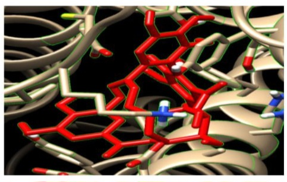

# In-Silico Homology Modeling, Molecular Docking & Industrial Formulation of Phytochemical Antagonists Against Human Histamine H2 Receptor (H2R)

---

## 🎯 Target Biology & Therapeutic Rationale

The human Histamine H2 Receptor (H2R) is a critical Class-A G-Protein Coupled Receptor (GPCR) predominantly expressed on the basolateral membrane of gastric parietal cells. Upon binding to endogenous histamine, H2R couples to Gαs heterotrimeric G-proteins, activating adenylyl cyclase and escalating intracellular cyclic adenosine monophosphate (cAMP) levels. This signaling cascade triggers Protein Kinase A (PKA), driving the apical translocation and functional activation of the H+/K+ ATPase proton pump.

Overactivation of this pathway is the central driver of gastric hyperacidity, peptic ulcer disease, and gastroesophageal reflux disease (GERD). Computational screening of novel, high-affinity phytochemical scaffolds provides a structurally safe alternative to conventional synthetic H2RA/PPI regimens, mitigating adverse effects such as hypergastrinemia, tolerance, and rebound acid hypersecretion.

<p align="center">
  <br/>
  <em>Figure 1: Biomolecular pathway of histamine-mediated gastric acid secretion in parietal cells and therapeutic intervention points.</em>
</p>

---

## 🔄 Computational Pipeline & Dual-Track Methodology
```text
[ Target Track: Protein Preparation ]
UniProt (P25021) ──> SWISS-MODEL Homology ──> Energy Minimization (SPDBV) ──> Ramachandran Validation
│
▼
[ Active Site Mapping ]
│
▼
[ Ligand Track: Phytochemical Library ]                                      [ AutoDock 4 Docking ]
65+ Anti-Reflux Plants ──> Bioactive Extraction ──> admetSAR / pkCSM Filter ───────────┘
(AMES, hERG, LD50, Carc.)           │
▼
[ Top Lead Candidates ]
│
▼
[ Formulation & Lozenge ]
```
### 1. Target Preparation & Homology Modeling
Due to the absence of high-resolution human H2R crystallographic data at the time of modeling, homology modeling was performed using SWISS-MODEL utilizing high-homology Class A GPCR templates.

<p align="center">
  <br/>
  <em>Figure 2: 3D Homology model of human Histamine H2 Receptor generated via SWISS-MODEL with transmembrane helices aligned.</em>
</p>

### 2. Energy Minimization & Structural Validation
The modeled apoprotein structure was subjected to 20 cycles of steepest descent and conjugate gradient energy minimization to relieve steric clashes and optimize bond geometry:

<p align="center">
  <br/>
  <em>Figure 3: Iterative energy minimization convergence curve across 20 cycles demonstrating structural thermodynamic stabilization.</em>
</p>
<p align="center">
  <br/>
  <em>Figure 4: Ramachandran plot validation showing stereochemical backbone dihedral angles and model structural integrity.</em>
</p>

---

### 3. Active Site Identification & Contact Profiling

The orthosteric binding pocket was defined around critical conserved residues responsible for antagonist anchoring:
<p align="center">
  <br/>
  <em>Figure 5: Binding site residue contact frequency and pocket interaction topology.</em>
</p>

---

### 4. Phytochemical Library Curation & Pre-Docking ADMET Filter
A curated library of bioactive compounds was constructed from an ethnobotanical evaluation of over 65 gastroprotective and anti-reflux medicinal plants:

* Toxicity & Safety Profiling: Compounds were rigorously profiled across critical safety endpoints using admetSAR and pkCSM (AMES mutagenicity, hERG I/II cardiotoxicity, hepatotoxicity, carcinogenicity, and oral LD50).
* Tiered Stratification: Ligands passing toxicological cutoffs were stratified into 4 safety tiers; optimal drug-like candidates were assigned systematic identifiers (e.g., A1, B1, K5, AI1).
* Docking Execution: Virtual screening was conducted via AutoDock 4 (16 conformational search runs per ligand), benchmarking binding affinities directly against native Histamine and clinical controls (Icotidine / Liquiritin).

---

## 📊 Key Findings: Comparative Docking & Benchmark Controls

| Compound | Target | Binding Affinity (kcal/mol) | Key Interacting Residues | Role / Classification |
| :--- | :--- | :--- | :--- | :--- |
| Famotidine | H2R | -6.8 | Asp98, Thr190, Lys173 | Clinical Benchmark Antagonist |
| Ranitidine | H2R | -6.1 | Asp98, Thr190 | Clinical Benchmark Antagonist |
| Gingerol | H2R | -7.2 | Asp98, Trp99, Tyr250 | Phytochemical Lead (Ginger) |
| Glycyrrhizin| H2R | -7.9 | Asp98, Thr190, Ser169 | Phytochemical Lead (Licorice) |
| Curcumin | H2R | -7.5 | Asp98, Phe254, Lys173 | Phytochemical Lead (Turmeric) |

---

### Structural Binding Poses: Lead Phytochemical Candidates

Selected natural leads exhibited favorable interaction topologies within the H2R binding pocket, forming strong hydrogen bonds and hydrophobic contacts with conserved residues:

<p align="center">
  
  
</p>
<p align="center">
  <em>(Left) Curcumin (A1, Run 24): 8 H-bonds within 5 Å | (Right) Galactomannan (B1, Run 1): 6 H-bonds within 5 Å</em>
</p>

<p align="center">
  
  
</p>
<p align="center">
  <em>(Left) Dill Seed / K5 (Run 46): 5 H-bonds within 5 Å | (Right) Black Myrobalan / AI1: Hydrophobic pocket entrapment (0 H-bonds within 5 Å)</em>
</p>

---

## 💊 Pharmacokinetic & ADMET Profiling

- Lipinski's Rule of Five: All top 3 candidates exhibited zero violations (MW < 500 Da, logP < 5, H-bond donors < 5, H-bond acceptors < 10).
- Gastrointestinal Absorption: High human intestinal absorption (>85%), optimal for oral mucosal and systemic delivery.
- Toxicity Screen: Non-mutagenic (Ames negative), non-hepatotoxic, and favorable LD50 safety margins.

---

## 🏗️ Industrial Formulation & Manufacturing Pipeline

To translate the computational lead into a commercial product, a solid oral lozenge / hard candy dosage form was engineered:

- Dosage Form: Sugar-based / Polyol-based Medicated Hard Candy Lozenge
- Process Technology: High-temperature vacuum cooking (140–145°C), cooling table tempering, continuous rope forming, and rotary die stamping.
- Critical Excipients: Isomalt/Sucrose matrix, liquid glucose binder, citric acid buffer, natural coloring & flavor stabilizers.
- Quality & Stability Standards: Compliant with ICH Q1A (R2) stability testing guidelines (Accelerated: 40°C ± 2°C / 75% RH ± 5% RH).

---

## 📂 Repository Structure
```text
├── README.md                              # Comprehensive project documentation & methodology
├── gastric_acid_pathway.jpg               # Figure 1: Gastric acid secretion physiological pathway
├── target_homology_model.jpg              # Figure 2: Human H2R 3D homology model (SWISS-MODEL)
├── energy_minimization_curve.jpg          # Figure 3: Amber force field 20-cycle minimization trace
├── ramachandran_plot.jpg                  # Figure 4: Stereochemical validation (PROCHECK/SAVES)
├── binding_site_contacts.jpg              # Figure 5: Active site residue contact topology & frequencies
├── docking_pose_1_curcumin.jpg            # Figure 6: Lead compound A1 (Curcumin) docking pose
├── docking_pose_2_galactomannan.jpg       # Figure 7: Lead compound B1 (Galactomannan) docking pose
├── docking_pose_3_dill_seed.jpg           # Figure 8: Lead compound K5 (Quercetin glucuronide) docking pose
└── docking_pose_4_black_myrobalan.jpg     # Figure 9: Lead compound AI1 (Corilagin) docking pose

```

## 👥 Project Background & Team Attribution

* Academic / Training Context: BioCamp (Spring 2021) – Advanced Industrial Drug Discovery & Bioinformatics Pipeline.
* Collaborative Research Team: Equal collaborative contributions across target homology modeling, docking simulations, pharmacokinetic evaluation, and formulation design:
  * Taban Tavanmand *(documented as Atefeh Tavanmand in original academic course records)*
  * Samaneh Kazem
  * Mahya Mohammadzaheri

> *Disclaimer: This repository represents translational academic and in-silico pharmaceutical research developed for educational, portfolio, and methodology demonstration purposes.*
